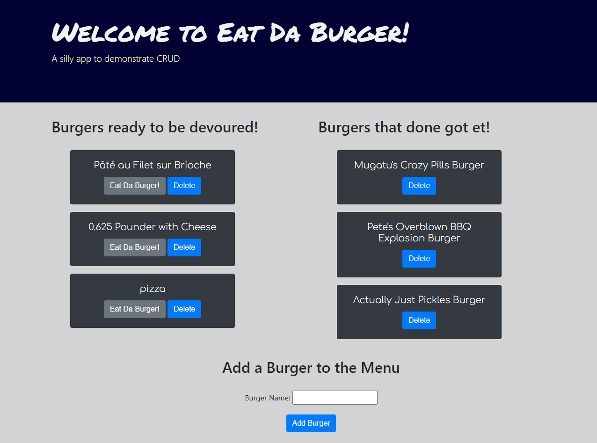

# Title: Eat-da-Burger

## Table of Contents:
* [Description](#Description)
* [Screenshot](#Screenshot)
* [Location of Deployed Project](#Location)
* [Notes from Dan](#Notes)
* [Credits](#Credits)
* [License](#License)

### <a name="Description">Description:</a>
This project is a full-stack app that demonstrates CRUD functionality using Express.js, Mysql.js, and a custom ORM in a simple MVC framework.  This project serves as a homework assignment submission for UT's web dev coding bootcamp.  It contains a codebase and a deployed webpage.

### <a name="Screenshot">Screenshot: </a>

### <a name="Location">Location of Deployed Project:</a>
https://dan-aument-eat-da-burger.herokuapp.com/

### <a name="Notes">Notes from Dan:  </a>
This project was my first truly full-stack application.  I enjoyed the process, but the prompt ("eat da burger") was very silly.  I was ultimately successful using the promisify utility to avoid passing callback functions all the way through my models and ORM.  In the future I plan on using mysql2.js for its promises and easier handling of objects in creating queries.  Also, I had grand plans to include a Font Awesome burger icon, but Bootstrap 4.6 has some compatability issues with Font Awesome 5.  The project can be found on my updated portfolio at https://danaument.github.io/updated-portfolio/.

### <a name="Credits">Credits: </a>
This project was completed by Dan Aument using code and assets provided by The Coding Boot Camp at UT Austin in partnership with Trilogy Education Services.  

### <a name="License">License: </a>

Distributed under the MIT License

MIT License

Copyright (c) 2020 Daniel Aument

Permission is hereby granted, free of charge, to any person obtaining a copy
of this software and associated documentation files (the "Software"), to deal
in the Software without restriction, including without limitation the rights
to use, copy, modify, merge, publish, distribute, sublicense, and/or sell
copies of the Software, and to permit persons to whom the Software is
furnished to do so, subject to the following conditions:

The above copyright notice and this permission notice shall be included in all
copies or substantial portions of the Software.

THE SOFTWARE IS PROVIDED "AS IS", WITHOUT WARRANTY OF ANY KIND, EXPRESS OR
IMPLIED, INCLUDING BUT NOT LIMITED TO THE WARRANTIES OF MERCHANTABILITY,
FITNESS FOR A PARTICULAR PURPOSE AND NONINFRINGEMENT. IN NO EVENT SHALL THE
AUTHORS OR COPYRIGHT HOLDERS BE LIABLE FOR ANY CLAIM, DAMAGES OR OTHER
LIABILITY, WHETHER IN AN ACTION OF CONTRACT, TORT OR OTHERWISE, ARISING FROM,
OUT OF OR IN CONNECTION WITH THE SOFTWARE OR THE USE OR OTHER DEALINGS IN THE
SOFTWARE.